    
# Epic Caboodle 

## A learning pathway for epic caboodle certification.

    

    
## Table of Contents

- [Solution Overview](#solution-overview)
- [Who will use this ?](#who-can-use)
- [Advantages of Using](#advantages-of-using)
- [Return on Investment (ROI)](#return-on-investment-roi)
- [How it Works](#how-it-works)
- [Conclusion](#conclusion)
- [Getting Started](#getting-started)
- [Solution Features](#solution-features)
- [Code Features](#code-features)
- [Deliverables or Figures](#deliverables-or-figures)
- [Contact Information](#contact-information)

# Caboodle   CDW110v Caboodle Data   Model Fundamentals

# Chapter 1 Introduction to Caboodle Data Model Fundamentals 

Welcome to Caboodle Data Model Fundamentals! This course introduces the basic tools, structures, and
concepts needed to understand and report on Caboodle data. You will learn the **organizational structure**
of the warehouse, key terms, and resources to help you better leverage Caboodle to write reports. You will
get a chance to explore and navigate the Caboodle portion of the **Cogito Data Dictionary** and apply what you learn
by writing and evaluating SQL queries against sample data.

Caboodle is a powerful analytics tool that can store custom data from Epic and non Epic sources. While
this course cannot predict every data point that will end up in your Caboodle database, it can familiarize
you with the data model and the accompanying documentation so that you can make the most out of
what Caboodle has to offer.

#### This material contains confidential and copyrighted information of Epic Systems Corporation

    

    
## Getting Started

The goal of this solution is to **Jump Start** your development and have you up and running in 30 minutes. 

To get started with the **Epic Caboodle** solution repository, follow these steps:
1. Clone the repository to your local machine.
2. Install the required dependencies listed at the top of the notebook.
3. Explore the example code provided in the repository and experiment.
4. Run the notebook and make it your own - **EASY !**
    
## Solution Features

- Easy to understand and use  
- Easily Configurable 
- Quickly start your project with pre-built templates
- Its Fast and Automated
- Saves You Time 

## Code Features

These features are designed to provide everything you need for **Epic Caboodle** 

- **Self Documenting** - Automatically identifes major steps in notebook 
- **Self Testing** - Unit Testing for each function
- **Easily Configurable** - Easily modify with **config.INI** - keyname value pairs
- **Includes Talking Code** - The code explains itself 
- **Self Logging** - Enhanced python standard logging   
- **Self Debugging** - Enhanced python standard debugging
- **Low Code** - or - No Code  - Most solutions are under 50 lines of code
- **Educational** - Includes educational dialogue and background material

    
## List of Figures
 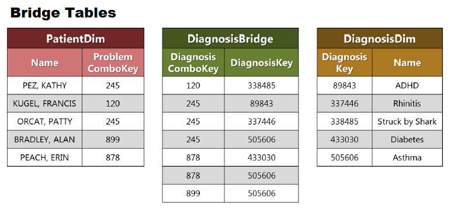   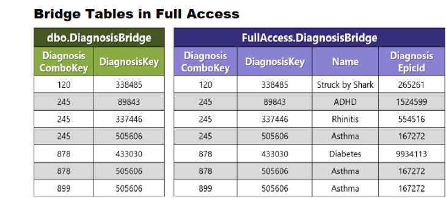   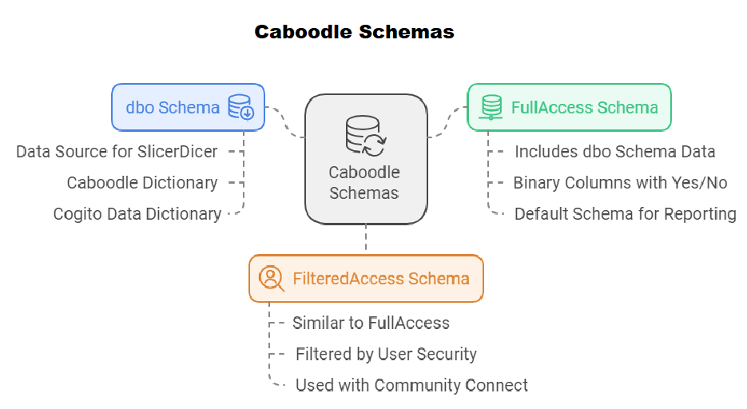   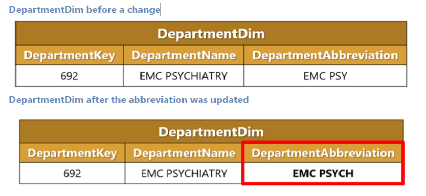      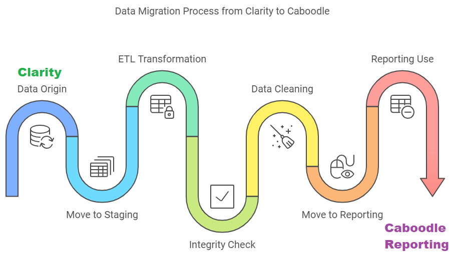      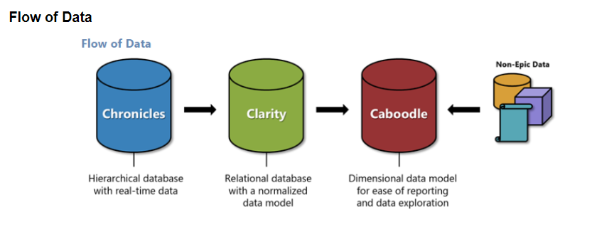   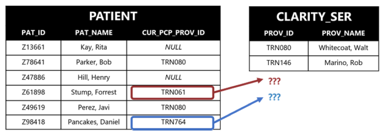   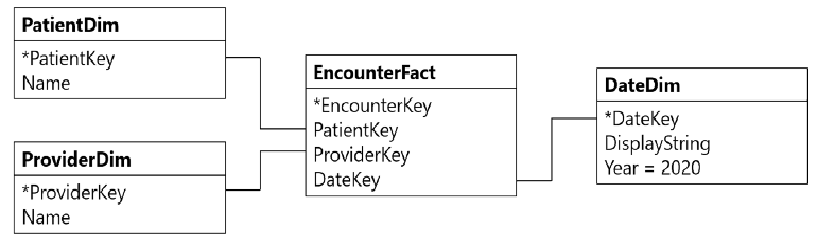   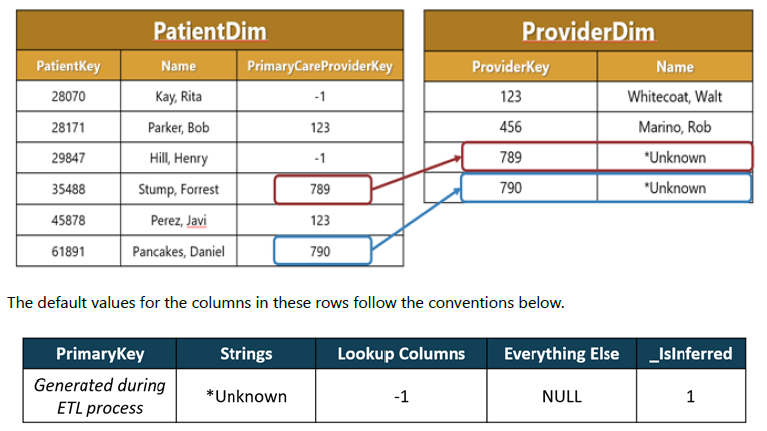   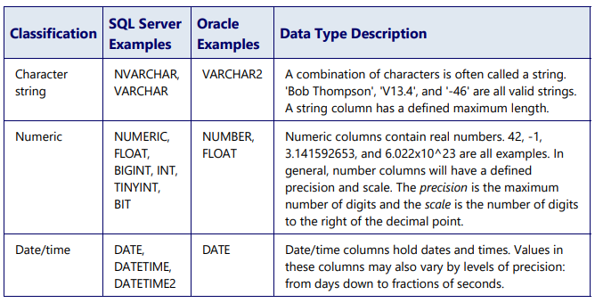   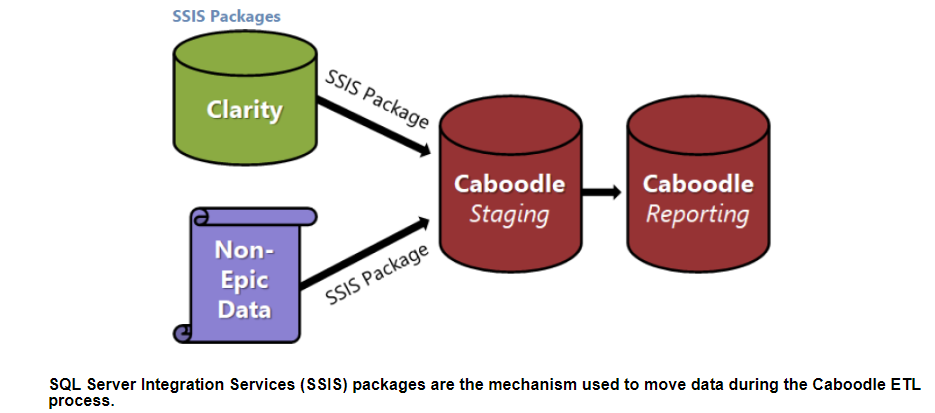   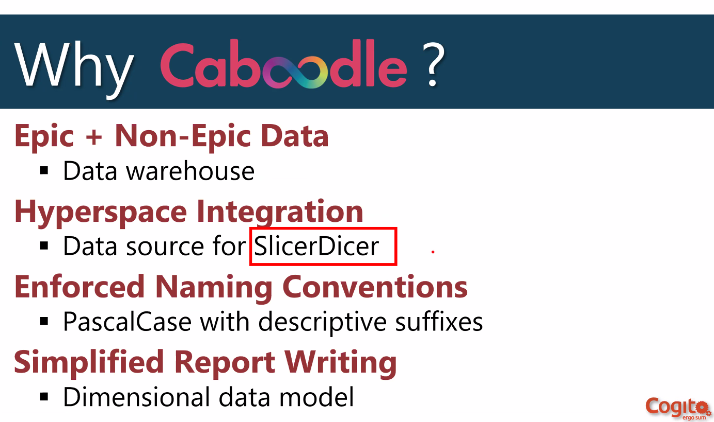   
    

## Github https://github.com/JoeEberle/ - Email  josepheberle@outlook.com 
    

    